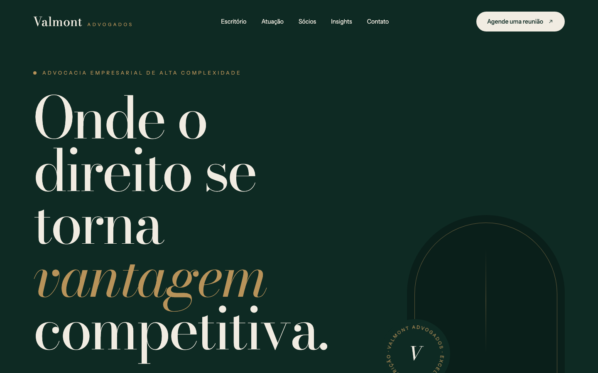
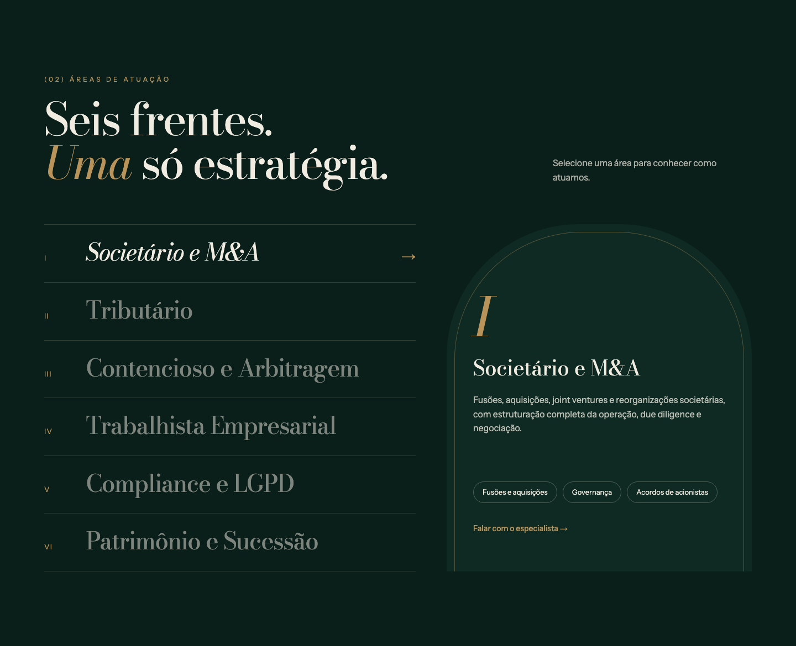
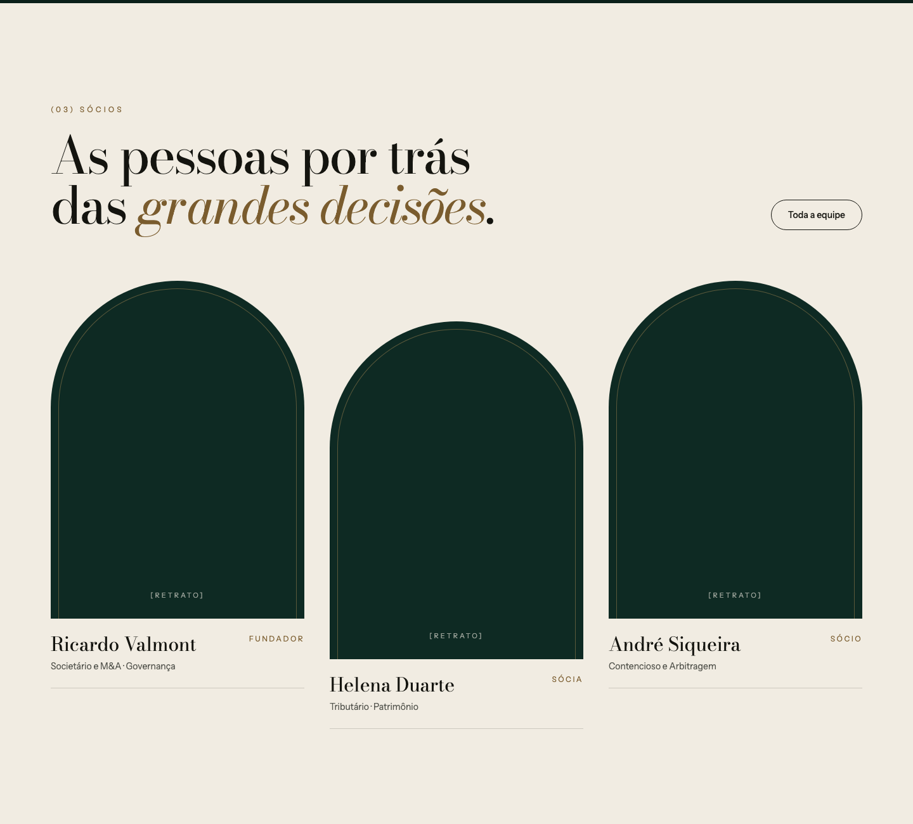
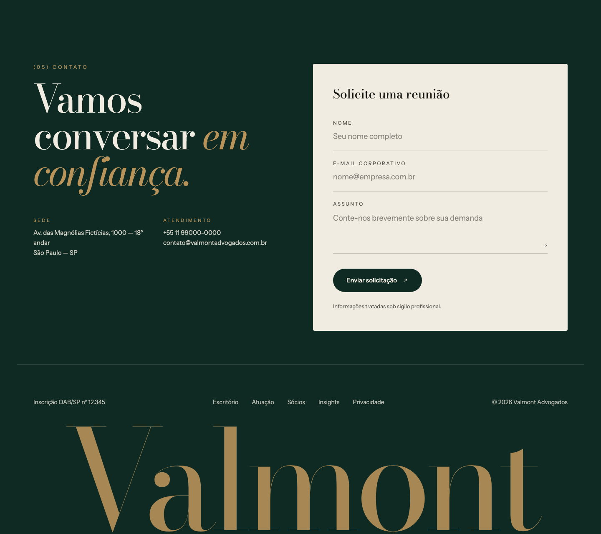
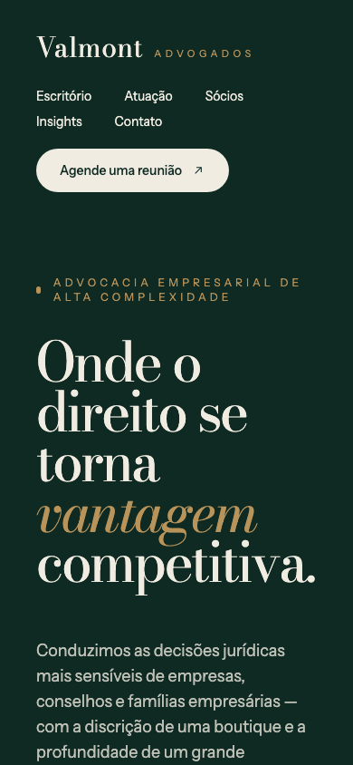

# Valmont Advogados

> Projeto criado para complementar o meu portfólio pessoal: **[portifolio-heitor.vercel.app](https://portifolio-heitor.vercel.app/)**
>
> A Valmont é um escritório de advocacia fictício — nomes, números, telefones e endereço são só para demonstração.

Landing page de um escritório de advocacia empresarial em São Paulo. A identidade visual é editorial e monumental:
tipografia serifada em grande escala, verde profundo com detalhes em latão e arcos que remetem à arquitetura clássica.

## O que tem no site

- **Hero com selo giratório** — título em grande escala, arco com selo animado e uma faixa rolando com as áreas de atuação.
- **Manifesto e números** — a filosofia do escritório, seus pilares e os números da casa.
- **Áreas de atuação interativas** — o visitante escolhe uma das seis áreas e o painel ao lado mostra como o escritório atua nela.
- **Sócios e insights** — quem conduz os casos e as publicações mais recentes do escritório.
- **Formulário de contato** — pedido de reunião, com endereço e canais de atendimento.
- **Responsivo** — o layout se adapta do desktop ao celular.

  

## Tecnologias

React 19, TypeScript, Tailwind CSS v4 e Vite.

## Acesse o site

**[valmont-advocacia.vercel.app](https://valmont-advocacia.vercel.app/)**
